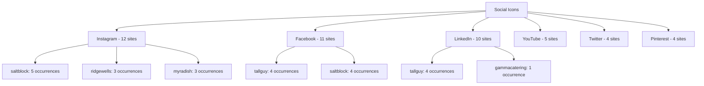

# Icon Usage Patterns

## Overview
**Source:** 15 catering reference websites  
**Extraction date:** 2025-01-18  

---

## Icon Libraries Detected

| Library | Usage | Sites Using |
|---------|-------|-------------|
| **Lucide React** | Primary icon library (our stack) | Referenced in code |
| **Font Awesome** | Social icons, some UI icons | Multiple sites |
| **Custom SVG** | Inline SVGs for branding | All sites |
| **Lottie** | Animated icons/illustrations | Some sites |

---

## Social Icons Usage

### Most Common Social Platforms

| Platform | Sites Using It | Total Occurrences |
|----------|---------------|-------------------|
| **Instagram** | 12 sites | ~45 |
| **Facebook** | 11 sites | ~25 |
| **LinkedIn** | 10 sites | ~22 |
| **YouTube** | 5 sites | ~8 |
| **Twitter/X** | 4 sites | ~6 |
| **Pinterest** | 4 sites | ~5 |

### Social Icons by Site



---

## Navigation Icons

### Navigation Icon Types Found

| Icon Type | Total Occurrences | Primary Use |
|-----------|-------------------|-------------|
| **Menu/Hamburger** | ~35 | Mobile menu toggle |
| **Close/X** | ~40 | Close modals/menus |
| **Arrow** | ~45 | Directional indicators |
| **Chevron** | ~5 | Accordion/carousel nav |
| **Nav (generic)** | ~50 | General navigation |

### Navigation Icons by Site

| Site | Menu | Close | Arrow | Chevron |
|------|------|-------|-------|----------|
| saltblock.com | 14 | 6 | 13 | - |
| gammacatering.com | 3 | 17 | 5 | 3 |
| tallguy.com | 6 | 3 | 5 | - |
| ridgewells.com | 5 | 3 | 3 | - |
| creativeedge.com | 3 | 3 | 5 | - |
| wolfgangpuck.com | 9 | 1 | 1 | - |

---

## Contact Icons

### Contact Information Icons

| Icon Type | Sites Using | Context |
|-----------|-------------|---------|
| **Email/Mail** | 13 sites | Contact forms, footer links |
| **Phone** | 6 sites | Click-to-call, contact info |
| **Location/Map** | 9 sites | Address, venue finder |
| **Address** | 7 sites | Postal address display |

### Contact Icons by Site

| Site | Email | Phone | Location | Map |
|------|-------|-------|----------|-----|
| cutandtaste.com | 3 | 1 | - | 1 |
| gammacatering.com | 1 | 2 | 16 | 1 |
| ridgewells.com | 3 | 3 | 3 | 1 |
| saltblock.com | 1 | - | 5 | 3 |

---

## Action / Interactive Icons

### Action Icons Found

| Icon | Occurrences | Use Case |
|------|-------------|----------|
| **Play** | ~85 | Video galleries, hero videos |
| **Pause** | ~15 | Video controls |
| **Search** | ~6 | Search functionality |
| **Cart** | ~10 | E-commerce/ordering |
| **Share** | ~20 | Social sharing |
| **Download** | ~2 | PDF menus, brochures |

### Play Button Usage (Video Heavy Sites)

| Site | Play Buttons | Notes |
|------|--------------|-------|
| saltblock.com | 19 | Very video-heavy |
| myradish.com | 12 | Video testimonials |
| ridgewells.com | 7 | Gallery videos |
| elegantaffairs.com | 4 | Hero video |
| tallguy.com | 4 | Portfolio videos |

---

## Recommended Lucide Icons for Catering Site

Based on analysis of what catering sites actually use, here are the recommended Lucide icons:

### Essential Navigation Icons
```javascript
import {
  Menu,           // Hamburger menu
  X,              // Close button
  ChevronRight,   // Next/forward
  ChevronLeft,    // Back
  ChevronDown,    // Expand accordion
  ArrowRight,     // CTA arrows
  ArrowUp,        // Back to top
  Home,           // Home link
} from 'lucide-react'
```

### Social Media Icons (use brand variants or custom)
```javascript
// Note: For social icons, consider using Simple Icons or custom SVGs
// for proper brand colors and recognition
```

### Contact & Location Icons
```javascript
import {
  Mail,           // Email contact
  Phone,          // Phone number
  MapPin,         // Location/address
  Clock,          // Business hours
  Calendar,       // Event booking
  Users,          // Team/about
  Building2,      // Venue locations
} from 'lucide-react'
```

### Action & Interaction Icons
```javascript
import {
  Play,           // Video play
  Pause,          // Video pause
  Search,         // Search functionality
  ShoppingCart,   // Order/cart
  Share2,         // Social share
  Download,       // Download menu/PDF
  ExternalLink,   // External links
  Send,           // Submit form
  Check,          // Success states
  AlertCircle,    // Error/warning
} from 'lucide-react'
```

### Content & Feature Icons
```javascript
import {
  Utensils,       // Catering/food service
  ChefHat,        // Chef/culinary
  Star,           // Ratings/reviews
  Heart,          // Favorites/wishlist
  Image,          // Gallery
  Video,          // Video content
  FileText,       // Menus/documents
  Award,          // Awards/excellence
  Truck,          // Delivery
  Gift,           // Special offers
} from 'lucide-react'
```

---

## Icon Implementation Patterns Found

### Pattern 1: Inline SVG with Symbol Definition
```html
<!-- From cutandtaste.com -->
<svg>
  <symbol id="facebook-icon" viewBox="0 0 64 64">
    <path d="M34.1,47V33.3h4.6l0.7-5.3h-5.3v-3.4c0-1.5..."/>
  </symbol>
</svg>
<svg><use href="#facebook-icon"/></svg>
```

### Pattern 2: Font Awesome Classes
```html
<!-- Common pattern found -->
<i class="fab fa-facebook"></i>
<i class="fab fa-instagram"></i>
<i class="fa-solid fa-play"></i>
<i class="fa-solid fa-chevron-right"></i>
```

### Pattern 3: Background Image Icons
Some sites use icon fonts or SVG background images via CSS.

### Pattern 4: Lottie Animations
For more complex animated icons:
```html
<div data-animation-type="lottie" data-animation-role="button">
  <!-- Lottie container -->
</div>
```

---

## Recommendations for Next.js + Lucide Setup

### 1. Create an Icon Map Component
```typescript
// components/ui/icon-map.tsx
import * as LucideIcons from 'lucide-react'

type IconName = keyof typeof LucideIcons

interface IconProps {
  name: IconName
  size?: number
  className?: string
}

export function DynamicIcon({ name, size = 24, className }: IconProps) {
  const IconComponent = LucideIcons[name] as React.ComponentType<any>
  
  if (!IconComponent) {
    return null
  }
  
  return <IconComponent size={size} className={className} />
}
```

### 2. Social Icons Component (with brand colors)
```typescript
// components/ui/social-icons.tsx
const socialLinks = [
  { name: 'instagram', url: '#', color: '#E4405F' },
  { name: 'facebook', url: '#', color: '#1877F2' },
  { name: 'linkedin', url: '#', color: '#0A66C2' },
  { name: 'youtube', url: '#', color: '#FF0000' },
]
```

### 3. Icon Sizing System
Based on usage patterns found:
- **Small**: 16px - Inline with text, badges
- **Medium**: 24px - Default navigation, buttons
- **Large**: 32px - Feature icons, hero section
- **XL**: 48px+ - Decorative, illustrations

---

## Summary Statistics

| Category | Unique Icons | Total Usage |
|----------|-------------|-------------|
| Social Media | 6 | ~110 |
| Navigation | 5 | ~130 |
| Contact | 4 | ~60 |
| Action/Interactive | 6 | ~140 |
| Content/Feature | 10+ | Variable |

**Total unique icon instances analyzed:** 500+
**Recommended core icon set:** 30-40 Lucide icons
